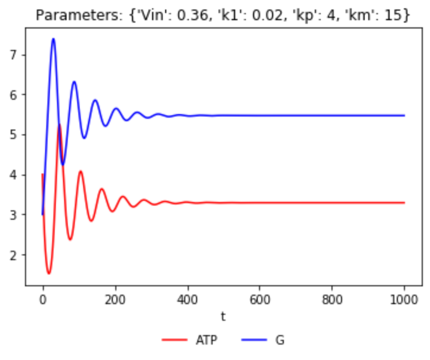
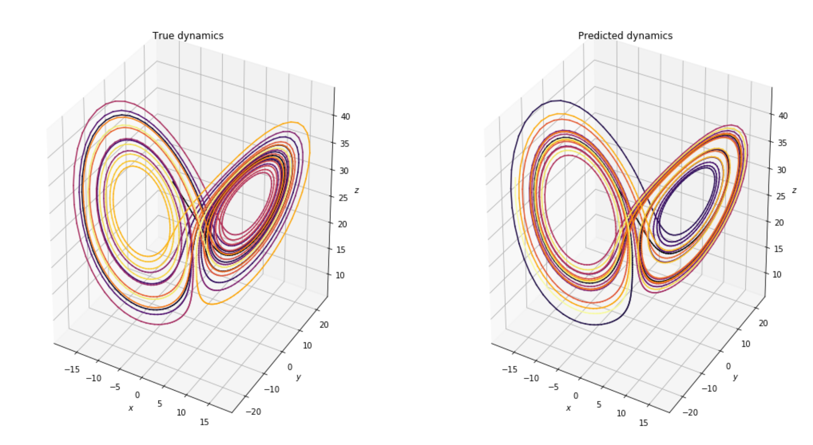
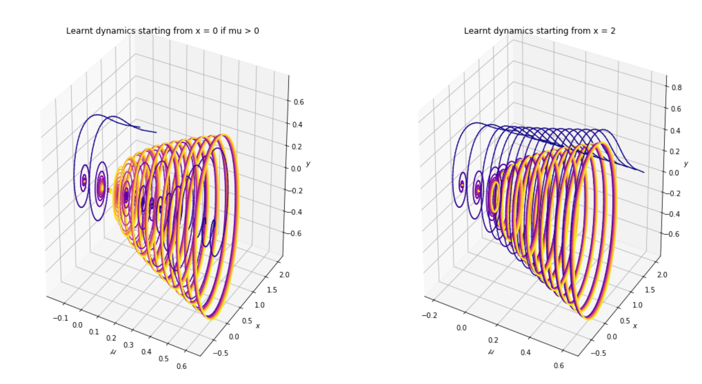
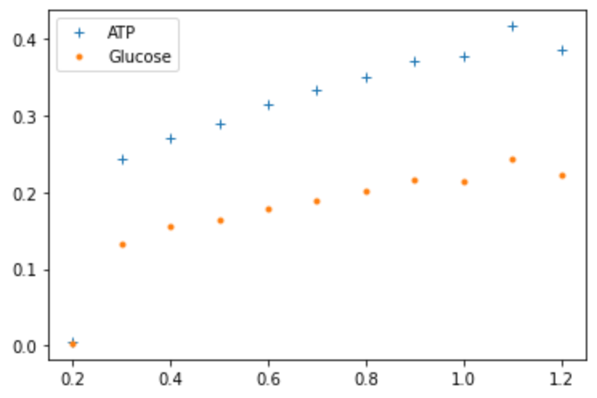
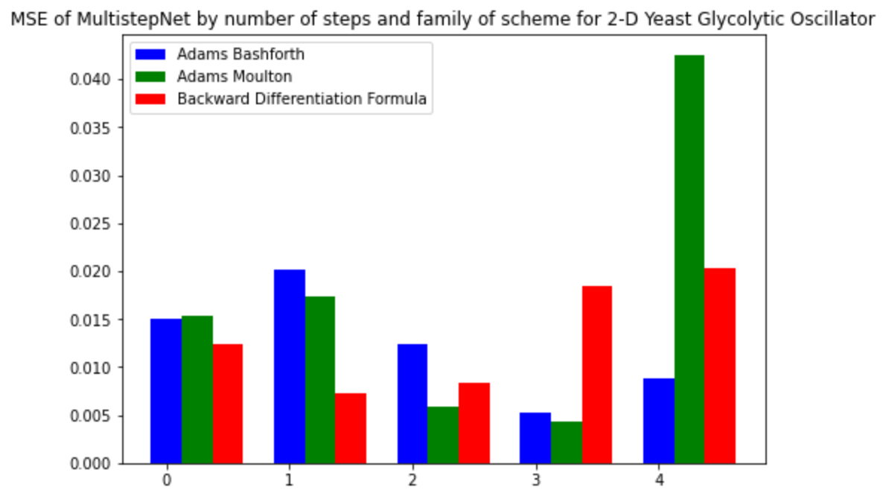
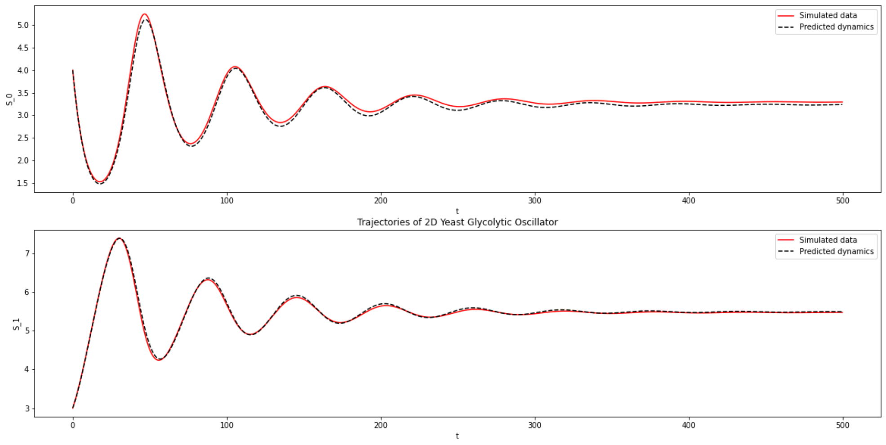
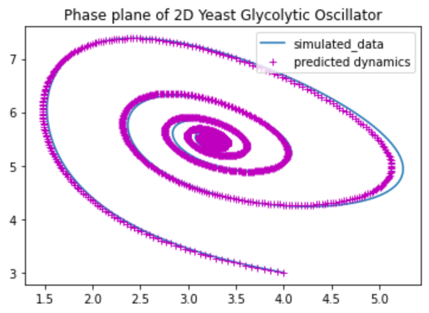
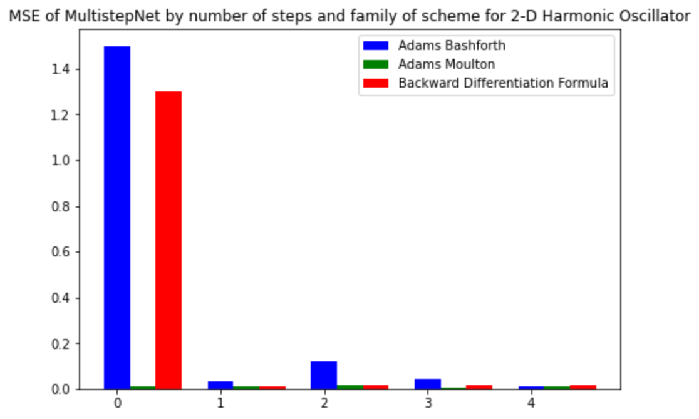
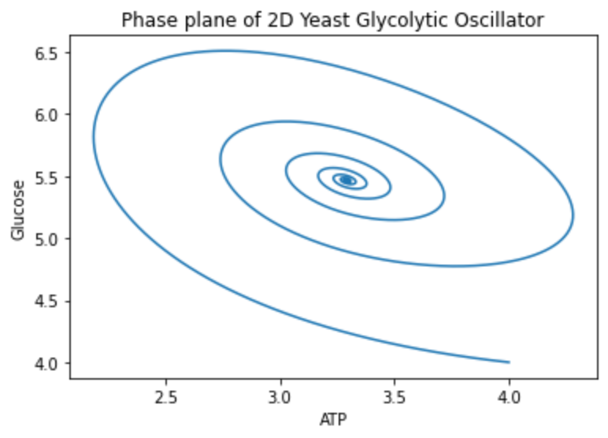
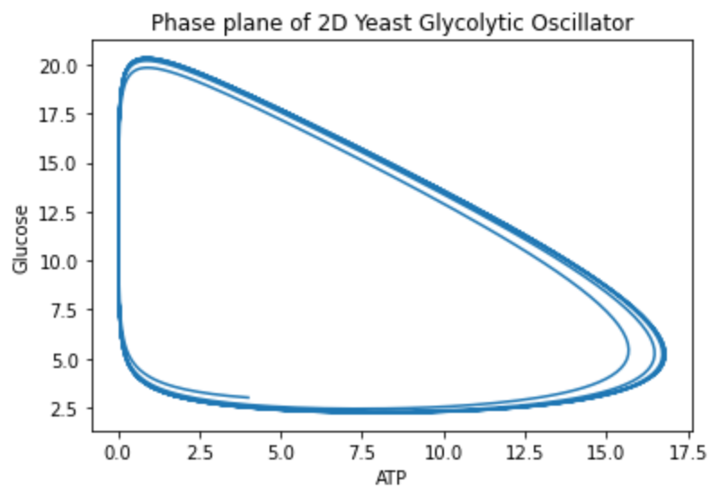

# Machine Learning Engineer Nanodegree
## Capstone Project
Kevin Siswandi  
May 2020

## I. Definition

### Project Overview

In the biosciences, [dynamic modeling](https://en.wikipedia.org/wiki/Dynamical_system) plays a very important role for understanding and predicting the behaviour of biochemical systems, with wide-ranging applications from bioengineering to precision medicine. For instance, understanding how a certain inhibitor affects the enzyme function is useful not just for improving titer, yield, and rate (TRY) in bioengineering, but also for designing personalized drugs. Traditionally, dynamic modeling of biochemical systems is done by painstakingly constructing a set of equations that characterises the system dynamics, which takes a long time to develop and does not scale with increasing amounts of data. To overcome these challenges, I implement a data-driven method based on machine learning that allows faster development of predictive dynamics and improves in performance when more data are available. I am fascinated by the opportunities created by the abundance of data and computing power in bioinformatics and would love to contribute to shaping the future of bioscience with machine learning, one step at a time.

To generate time-series data for training and testing the model, I will simulate time-series concentrations from the [glycolytic oscillations in yeast cells](https://www.ncbi.nlm.nih.gov/pmc/articles/PMC1300712/). This is done by solving the system of equations using a numerical integrator from the open-source `scipy` library.

### Problem Statement

The goal is to create a machine learning approach that can fully characterize how a biochemical system evolves with time. The tasks involved are:
1. Generate time-series data by simulating ATP and Glucose concentrations
2. Build a multistep neural network using TensorFlow that can simulate dynamics after learning from time-series data
3. Train the multistep neural network on the data from yeast glycolysis
4. Evaluate the performance of the method on three regimes of different biological behaviour

The final product is expected to be useful for predicting the dynamics of a complex biochemical system given various initial conditions, which has relevant use cases for bioengineering and precision medicine.

For more details of the potential commercial applications:
- Chubukov, V., Mukhopadhyay, A., Petzold, C. J., Keasling, J. D. & Martn, H. G. Synthetic and systems biology for microbial production of commodity chemicals. NPJ Syst. Biol. Appl. 2, 16009 (2016).
- Chen, R. & Snyder, M. Promise of personalized omics to precision medicine. Wiley Interdiscip. Rev.: Syst. Biol. Med. 5, 73–82 (2013).

### Metrics

Because we are dealing with continuous values, the natural metric to use is the mean squared error (MSE), which is the L2 norm of the discrepancy between predicted and true dynamics.

## II. Analysis

### Data Exploration

I analyze the data that are simulated using the [2-D yeast glycolysis model](https://www.ncbi.nlm.nih.gov/pmc/articles/PMC1300712/). To generate the data, I construct the system of differential equations using three regimes of parameter values:
1. Default regime (resulting in oscillatory behaviour)
2. Damped oscillatory regime
3. Bifurcation regime (the point at which state transition happens)

The resulting data consists of time-series concentrations of ATP and Glucose that mimics the glycolysis pathway in yeast cells. The primary interest of this project is to re-discover the qualitative behaviour of the complex biochemical system using neural network, so I made a detailed analysis in `Analysis - Data Exploration and Visualization`.

In particular, the following findings are important insights:
- The frequency of oscillation of ATP is similar/same as Glucose when sustained oscillations are present
- The system is [bistable](https://en.wikipedia.org/wiki/Bistability) with two possible steady states: a stable fixed point/equilibrium and a stable limit cycle.

### Exploratory Visualization

With the default parameter values, the system exhibits an oscillatory behaviour:

Reducing the glucose transport rate to 0.1, however, results in a very different qualitative behaviour where there is a short burst of ATP followed by linear increase in Glucose:

The bistability in the system is evident from the presence of a stable limit cycle in yet another parameter regime:

To find the point of bifurcation where the state transition occurs, I plot the maximum and minimum values of [G] and [ATP] after a sufficiently long period:

It can be seen from the bifurcation plot that the system changes its qualitative behaviour (from oscillating to a stable fixed point) when the glucose transport rate (Vin) is around 1.3

These visualizations are important because the implementation of the machine learning approach must be able to recover the above dynamic behaviour. Apart from discovering dynamics, it should also correctly identify bifurcation.

Plot Glossary:
- [ATP] = Time-series concentration of Adenosine Triphosphate
- [G] = Time-series concentration of Glucose
- Vin = Initial Glucose transport rate
- k1, kp, km = Parameters of the enzyme kinetics

### Algorithms and Techniques

The objective is to find the function `f` that best represents the dynamics in the data, which is the right hand side of the ordinary differential equations (ODE) in dynamic modeling. This is done by formulating a supervised learning problem embedded in the numerical framework of [linear multistep methods (LMM)](https://en.wikipedia.org/wiki/Linear_multistep_method). Formally, we proceed as follows.

Note the use of the squared error (L2 norm) in the loss function. To solve the optimization problem, I build a [MultiStep Neural Network](https://maziarraissi.github.io/research/7_multistep_neural_networks/) in TensorFlow 2.2, embedded in numerical framework of LMM from [SymPy](https://www.sympy.org/en/index.html). From preliminary experiments, the following hyperparameters are identified to be important/significant for performance:
- step size of the LMM scheme
- the number of steps
- the family of the LMM scheme (either Adams Bashforths, Adams Moulton, or Backward Differentiation Formula)

A more detailed look at the algorithm and the implementation can be found in the notebook `Algorithm - MultistepNet.ipynb`. The algorithm takes time-series data as input and returns the derivatives as output, which can then be integrated using `scipy.odeint` to get the predictions.

### Benchmark

This is the first time the multistep neural network method is applied to the 2-D Yeast Glycolysis problem. Therefore, the performance results of multistep neural network for a similar system (2-D Cubic Oscillator) are used as a benchmark. The benchmark results are taken from [MultiStep Neural Network](https://maziarraissi.github.io/research/7_multistep_neural_networks/), which are empirical MSE (L2 error) between the predicted and exact trajectory.

Note: a related approach is the [implicit SINDy method](https://ieeexplore.ieee.org/stamp/stamp.jsp?arnumber=7809160), which uses LASSO regression to find a sparse representation to a library of candidate functions. However, it assumes prior knowledge about the dynamical systems and requires the user to specify prior candidate functions. Since the method was not applied to the specific problem in this project and is more computationally expensive, it is left as a possibility for future work.

## III. Methodology

### Data Preprocessing

Since I am simulating the data myself, I generate the data such that it is in the form that is suitable for training the multistep neural network. The required steps are:
- define the equations for the ODE model
- specify the parameter values for the ODE model
- solve the ODE to obtain time-series, given initial value
- add Gaussian noise into the data (optional)
- reshape the array into 1 x array.shape[0] x array.shape[1]. This is necessary because the multistep neural network is written to be able to handle multiple trajectories (my future work -- in this project I deal only with 1 trajectory).
- transform the values into tensor with type `tf.float32`

During inference, the data must be reshaped to get rid of the redundant dimension via `np.squeeze()`.

### Implementation

I design a custom model using the TensorFlow subclassing API. The Neural Network model class is defined in `model.py`, while the function to generate output is defined in `predict.py` and the training of the multistep neural network is implemented in the Python script `train.py`. All nontrivial methods and classes are documented with docstrings and comments.

The overall implementation consists of the following steps:
1. Generation of training and test data via `bier(...)` function
2. Construction of the Multistep Neural Network via the `lmmNet(...)` class:
  - load LMM coefficients from `nodepy` according to the family of LMM scheme
  - arrange the coefficients to conform with equation (2) in [MultiStep Neural Network](https://maziarraissi.github.io/research/7_multistep_neural_networks/)
  - define a feed-forward neural network with one hidden layer (tanh activation function)
  - implement the linear difference operator for LMM in the `get_Y(...)` method (see, for example, Chapter 5 in [Numerical Analysis of ODE](https://www.mathsim.eu/~gkanscha/notes/ode.pdf))
  - implement the function `get_F(...)` that gives the output of the neural network and is used by the linear difference operator
  - define the `train(...)` function
  - define the `predict(...)` function -- this function (in `model.py`) is then used by `predict.py` to make predictions by numerical integration
3. Implementation of the metrics MSE (L2-error) using `numpy.linalg.norm` function in the `compute_MSE` function (accessible in the notebook `Benchmark - 2D Cubic Oscillator`).

The implementation of the multistep neural network takes the step size, number of steps, and the family scheme as input arguments. This is an important design choice because the best parameter set may be problem-dependent. The performance results for different settings of the hyperparameters are reported in section 4.

**Remark**: in the future, the number of hidden layers can be tuned to get a better performance, but for now I use a single layer to get a working implementation.

### Refinement

To test the correctness of my implementation, I apply the method to the example systems discussed in [MultiStep Neural Network](https://maziarraissi.github.io/research/7_multistep_neural_networks/). Specifically, the model is able to:
- reconstruct the chaotic dynamics of the Lorenz system (see `Refinement - Lorenz.ipynb`)
- rediscover Hopf bifurcation (see `Refinement - Hopf Bifurcation.ipynb`)

Due to the chaotic nature of the Lorenz system, small differences between the exact and learned model grow exponentially with time. However, the attractor form (butterfly effect) in 3-D Euclidean space is still well captured:

The model is also successful in discovering the [Hopf bifurcation](https://en.wikipedia.org/wiki/Bifurcation_theory) of the Hopf normal form:

Note the dramatic change in the behaviour as the parameter mu transitions from negative to positive values, signaling a bifurcation (stable fixed point to stable limit cycle). These preliminary results provide a level of confidence that the model is working properly. However, I still have to find the right step size to use for the 2-D Glycolytic Oscillator. In order to find the right step size, I compare the MSE of the model as the step size is varied:

We can see that smaller step size gives better performance, which is consistent with earlier findings in [MultiStep Neural Network](https://maziarraissi.github.io/research/7_multistep_neural_networks/) for other systems. Furthermore, I experiment with different number of epochs to find out how many training iterations are sufficient for the multistep neural network to adequately learn the dynamics. As seen in `Refinement - Step Size.ipynb`:
- at 5 epochs, the model only learns the early phase of the dynamics.
- at 100 epochs, the model starts to learn the oscillatory behaviour and captures the steady state at long time period
- at 1000 epochs, the model captures the dynamics of the system, including the characteristic peaks and steady state.

Based on these findings, I choose to train the model for 10000 epochs so that it can adequately learn the dynamics in the system.

## IV. Results

### Model Evaluation and Validation

In order to evaluate the model against the benchmark, I make an extensive report on the MSE results for different number of steps (M = 1, 2, 3, 4, and 5) and family of LMM scheme:

The results show that using the Adams Bashforths scheme with M = 3 gives the lowest MSE (best performance). Therefore, this setting is selected as the final model to evaluate on the test data:

The final model is able to predict the dynamics of the test data fairly well in both species (Glucose and ATP). Plotting this in the phase space, the convergence to a stable limit cycle can be clearly seen:

Finally, the model is evaluated on test data with initial conditions that were not seen before by the model:

This suggests that the model is robust enough to handle unseen data and able to predict dynamics of the system given arbitrary initial conditions. The code to generate these results are available in the notebook `Results - Evaluation and Validation.ipynb`.

### Justification

The results from the previous section suggest that the multistep method provide consistently good performance (within the same order of magnitude) for all three schemes of LMM when applied to the 2-D Yeast Glycolytic Oscillator problem. In comparison, the MSE for the 2-D Harmonic Oscillator, as reported in [MultiStep Neural Network](https://maziarraissi.github.io/research/7_multistep_neural_networks/), show significantly worse performance when using single step for AB and BDF:

In [MultiStep Neural Network](https://maziarraissi.github.io/research/7_multistep_neural_networks/), it was hypothesized that the superior performance of the Adams Moulton scheme may be due to the arrangement of the terms in the trapezoidal rule. However, we see that this is not the case here for the 2-D Yeast Glycolytic Oscillator. This exciting result should motivate further study in this area to investigate the mathematical properties of the method (in a [recent paper](https://arxiv.org/abs/1912.12728), it has been shown that the Multistep Neural Network is **not stable** for M > 1 in the Adams-Moulton scheme). In particular, our findings are consistent with the theoretical properties regarding the stability of AM recently published in [the paper](https://arxiv.org/abs/1912.12728), indicated by the doubling in the error for M = 4 in the AM scheme.

In addition to having consistent performance across all family of LMM schemes for predicting the dynamics of the 2-D Yeast Glycolytic Oscillator, the method shows robust ability to identify bifurcations and chaotic attractors (section 3 -- refinement). However, some limitations exist for the practical deployment of the method:
* Multistep neural network expects time-series data at regular intervals, but most data in biological systems are sampled at irregular time intervals. A workaround is to preprocess the data such that the resulting time-series is uniformly spaced.
* The multistep neural network requires sufficiently dense time points (in our simulated data, we use 2500 time points). However, several real biological datasets have very few time points. A workaround is to use data augmentation strategies to obtain denser training data.

## V. Conclusion

### Free-Form Visualization

A major test for the robustness of multistep neural network for the 2-D Yeast Glycolysis problem is whether it can discover bifurcation (a.k.a. state transition), where the system dramatically changes its qualitative behaviour from steady-state behaviour:

to sustained oscillation:

Here, the x-axis is the time-course concentration of ATP while the y-axis is the time-course concentration of Glucose. As seen in the exploratory analysis (see `Analysis - Data Exploration and Visualization.ipynb`), one important parameter of the Bier model that influences the state transition is Vin (the glucose transport rate). Rearranging the system of equations to introduce Vin as an extra dimension (see `Results - Evaluation and Validation.ipynb`), the multistep neural network can be trained by treating the extra dimension (Vin) as set of trajectories. Visualing the inference results in the phase space, we can clearly see the bifurcation:

Note the transition from oscillatory to stable steady state system when Vin crosses the value of 1.3. Here, the inference is performed on initial conditions not seen before during training, demonstrating the robustness of the model.

### Reflection

The MultiStep Neural Network takes in the time-series data as input and learns the function/derivative that describes the dynamics. Before it can be used to make predictions, the function must be integrated (using `scipy`). The benefit of this method is that it allows a full characterization of how the system will develop in time given only some initial values, which has plenty of use cases in bioengineering (and precision medicine).

In this project, I blend Linear Multi-step method with Machine Learning and Neural Networks by formulating a supervised learning problem in the framework of the linear multistep method. By doing so:
* we do not need artificial creation of derivatives (c.f [other works](https://www.nature.com/articles/s41540-018-0054-3) that compute derivatives explicitly to create training data)
* we can look into the history of dynamics (via multi-step method) to predict ‘future’ dynamics
* we are able to discover complex oscillations, bistabilities, and bifurcations purely from data.

### Improvement

There are a few ways in which the model can be improved:
1. Quantification of uncertainty -- one can further extend this method to predict not only the dynamics, but also the uncertainty/confidence interval associated with it. One possible idea is to use dropout to randomly turn off the neural network units; repeating this to get multiple predictions can give an uncertainty estimate.
2. Model interpretation -- at the moment the multistep neural network is a blackbox model, but it can be improved by using explainable AI techniques to extract insights from what the model has learned; this can be very useful for scientists to better understand the dynamical system under study.

-----------
